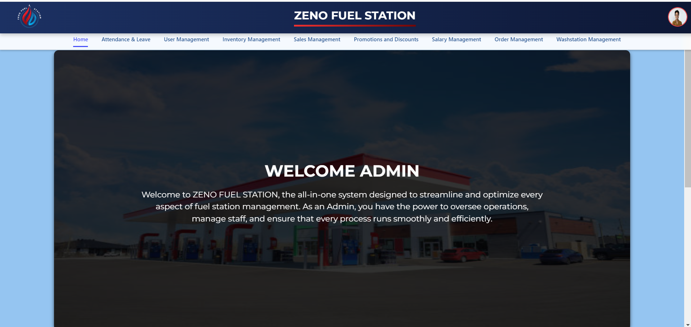

# ⛽ Fuel Station Management System

<!-- Replace with an appropriate image URL -->

---

## 🌟 *Overview*

The *Fuel Station Management System* is an *all-in-one* web-based application designed to streamline fuel station operations. The system provides a range of functionalities for **Workers**, **Managers**, and **Admins**. It efficiently manages user accounts, inventory, sales, attendance, orders, promotions, and supplier interactions, offering a seamless experience for employees and administrators.

---

## 🔑 *Key Features by Role*

### **Worker Features**

- *👤 User Account Management*  
  Workers can log in, update their profiles, and reset passwords when necessary.

- *🕒 Attendance Management*  
  Workers can log their attendance and apply for leaves.

- *📊 Inventory Monitoring*  
  Workers can check the inventory status and request restocking when necessary.

---

### **Manager Features**

- *👤 User Account Management*  
  Managers can view and update **Worker** details but cannot create or delete accounts.

- *🕒 Attendance Management*  
  Managers can review **Worker** attendance, approve or reject leave applications, and generate attendance reports.

- *📦 Order Management*  
  Managers can create, update, and monitor orders and interact with suppliers.

- *📊 Reports Generation*  
  Managers can generate reports on attendance, sales, and inventory levels.

- *📬 Inquiry Management*  
  Managers can handle customer inquiries and address any issues that arise.

- *📦 Inventory Monitoring and Management*  
  Managers have permission to monitor and manage inventory levels.

---

### **Admin Features**

- *👤 User Account Management*  
  **Admins** have full control over creating, updating, and deleting **Manager** and **Worker** accounts. They can set initial login credentials and define user roles.

- *📈 Admin Dashboard*  
  Admins have access to key performance indicators such as inquiry counts, order statuses, and inventory levels.

- *🕒 Attendance and Salary Management*  
  Admins can monitor attendance records and manage salary calculations based on those records. This includes adjustments in payroll for leaves and overtime.

- *💸 Promotions and Discounts Management*  
  Admins manage promotional codes and discounts to attract customers and boost sales.

- *🛠️ Supplier Management*  
  Admins can oversee supplier interactions, place large orders, and evaluate supplier performance.

- *🛒 Shop Sales Management*  
  Admins can oversee shop sales, handle transactions, apply discounts, and manage product returns.

- *⛽ Fuel Sales Management*  
  Admins can manage fuel sales transactions, pricing, and ensure accurate fuel dispensing.

- *📊 Reports Generation*  
  Admins can generate detailed reports on various aspects like attendance, sales, inventory, and employee performance.

---

## 📈 *Workflow by Role*

### **Worker Workflow**

1. *👥 Registration*: Workers are registered by **Admins**.
2. *🔐 Login*: Workers log in using their assigned credentials.
3. *📝 Profile Management*: Workers can update their personal profiles and passwords.
4. *🕒 Attendance Logging*: Workers log attendance and apply for leave.
5. *📊 Inventory Monitoring*: Workers check inventory and request restocking.

### **Manager Workflow**

1. *🔑 Login*: Managers log in with their credentials.
2. *📝 Profile Management*: Managers can view and update worker profiles.
3. *🕒 Attendance Management*: Managers monitor worker attendance and manage leave requests.
4. *📦 Order Management*: Managers handle orders and interact with suppliers.
5. *📊 Reports Generation*: Managers generate reports on employee attendance and sales performance.

### **Admin Workflow**

1. *🔑 Login*: Admins log in with their credentials.
2. *👤 User Management*: Admins create and manage accounts for both Managers and Workers.
3. *📊 Dashboard Management*: Admins monitor key metrics related to inventory, sales, and inquiries.
4. *💸 Promotions and Discounts Management*: Admins manage promotional codes and oversee sales campaigns.
5. *🛠️ Supplier Management*: Admins place orders and track supplier performance.
6. *📦 Product and Inventory Management*: Admins add new products, manage stock levels, and oversee fuel sales.
7. *📊 Reports Generation*: Admins generate comprehensive reports for system evaluation and decision-making.

---

## 🛠️ *Technologies Used*

<div>
  
  
  
  
</div>

---

## 👥 *Project Contributors*

<table>
  <tr>
    <td align="center">
      <a href="https://github.com/It22643018">
        <br />
        M.R.F Shakeeka
      </a><br />
      Contributions:  
      - User Account Management & Salary Calculation Management
    </td>
    <td align="center">
      <a href="https://github.com/Ahamed-Rahman">
        <br />
        F.R Ahamed
      </a><br />
      Contributions:  
      - Inventory Management & Supplier Management 
    </td>
    <td align="center">
      <a href="https://github.com/Dinuka24-coder">
        <br />
        D.H Amarasekara
      </a><br />
      Contributions:  
      - Fuel Sales Management  
    </td>
    <td align="center">
      <a href="https://github.com/IT21129544">
        <br />
        A.L.M Athulathmudali
      </a><br />
      Contributions:  
      - Promotions and Discounts Management  
    </td>
  </tr>
  <tr>
    <td align="center">
      <a href="https://github.com/Dhananjaya-14">
        <br />
        D.M.D.B Bulumulla
      </a><br />
      Contributions:  
      - Order Management  
    </td>
    <td align="center">
      <a href="https://github.com/username6">
        <br />
        W.M.P.J Wijenayake
      </a><br />
      Contributions:  
      - Wash Station Control  
    </td>
    <td align="center">
      <a href="https://github.com/Shesh-IT">
        <br />
        W.A.S.P.D Wijesinghe
      </a><br />
      Contributions:  
      - Shop Sales Management  
    </td>
    <td align="center">
      <a href="https://github.com/IT22644008">
        <br />
        A.R Nifla
      </a><br />
      Contributions:  
      - Attendance Management  
    </td>
  </tr>
</table>

---

## 📋 *Getting Started*

To set up the *Fuel Station Management System* on your local machine, follow these steps:

1. **🛠️ Clone the repository**:
   ```bash
   git clone https://github.com/yourusername/fuel-station-management-system.git
